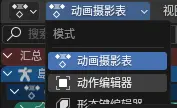

# Shimakaze.Sdk SHP Blender

使用说明

这个扩展适用于 Blender 4.2 以上版本, 与 DonutArnold 的模板[^template]配合使用

在 3D 视图中找到 `SHP` 面板
1. 点击`启用`（此设置绑定场景）
2. 在`目标`处填入根对象（一般来说是个纯轴）
3. 填入`透明脚本`（渲染透明背景图像填 `Alpha.Enable` 否则填 `Alpha.Disable`）
4. 填入`对象脚本`（Cycles 渲染填 `Cycles.Render.Object` 否则填 `Eevee.Render.Object`[^eevee]）
5. 填入`影子脚本`（Cycles 渲染填 `Cycles.Render.Shadow` 否则填 `Eevee.Render.Shadow`[^eevee]）
6. `动画目标`填骨骼

> [!NOTE]
>   
> 在制作动画时选择`动作编辑器`  
> 这样就可以在一个文件内制作多个动作了  
> 记得需要在创建动作时给每一个动作的第0帧添加**所有骨骼**的关键帧

剩下的设置是**绑定动作**的

- `起始帧`与`结束帧`：记录在动作上，在动作列表切换动作时可以轻松设置场景的起始和结束帧
- `方向数/8`：此属性*8为实际的方向数 默认为1 表示这个动作有8个方向 填0表示只有一个方向
- `物体方向`：此属性修改`动画目标`的`欧拉旋转`的Z轴值 值为 `物体方向`*`每方向角度`
- `应用关键帧`：此按钮根据已有信息自动生成`动画目标`的`欧拉旋转`的Z轴值常值关键帧

[^template]: [PPM](https://ppmforums.com/topic-36965/blender-templates-tdra-ts-ra2/) [revora](https://forums.revora.net/topic/97398-blender-templates-tdra-ts-ra2/)
[^eevee]: 由于 API 变动，EEVEE脚本需要修改第三行的引擎名称 从 `BLENDER_EEVEE` 改为 `BLENDER_EEVEE_NEXT`

## 所属色材质
所属色材质是为 [Shimakaze.Sdk.Shp.Maker](https://github.com/ShimakazeProject/Shimakaze.Sdk/tree/HEAD/src/shp/Shimakaze.Sdk.Shp.Maker) 工具设计的

右侧从上到下分别是 `创建所属色阻隔节点组` `添加选中材质` `从列表中移除材质`

`创建所属色阻隔节点组`：此按钮会创建一个名为 `HouseNodeGroup` 的节点组

在设置`类型`为`所属色`时 所有不在列表中的材质的`HouseNodeGroup`节点组的系数都会被设置为 `1`

这样设置后 场景中将只显示将要被渲染为所属色的部分
